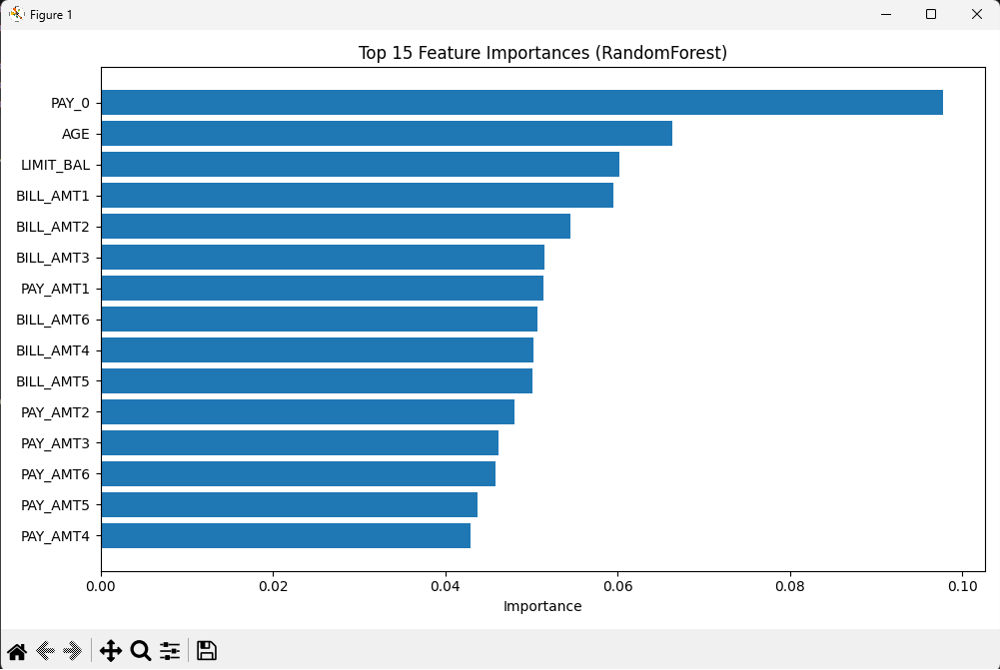

# Credit Card Default Prediction

Machine learning project focused on predicting customer credit card default risk using multiple classification models and performance evaluation metrics.

## Overview

This project analyzes a real-world credit card dataset containing 30,000+ customer records and compares multiple machine learning algorithms for predicting whether a customer will default on their next payment.

The project includes:
- Data preprocessing
- Feature scaling
- Stratified train/validation/test splitting
- Model comparison
- Performance evaluation
- Feature importance analysis
- Visualization of important predictors

---

## Technologies Used

- Python
- Pandas
- NumPy
- Scikit-learn
- Matplotlib

---

## Models Implemented

The following machine learning models were trained and evaluated:

- Logistic Regression
- K-Nearest Neighbors (KNN)
- Decision Tree
- Random Forest
- Gradient Boosting
- Gaussian Naive Bayes

---

## Dataset

- 30,000+ credit card client records
- Binary classification problem:
  - `0` → No default
  - `1` → Default payment next month

The dataset includes:
- Credit limit information
- Billing amounts
- Payment history
- Demographic information
- Repayment status features

---

## Evaluation Metrics

Models were evaluated using:

- Accuracy
- Precision
- Recall
- F1-Score
- ROC-AUC

### Best Model Performance

| Model | F1-Score |
|---|---|
| Gaussian Naive Bayes | 0.50 |

---

## Key Findings

- Repayment status (`PAY_0`) was identified as the strongest predictor of default risk.
- Gradient Boosting and Random Forest achieved the highest overall accuracy.
- Naive Bayes achieved the best F1-score and recall balance for detecting default cases.

---

## Feature Importance Visualization

The project includes Random Forest feature importance analysis to identify the most influential predictors.

---

